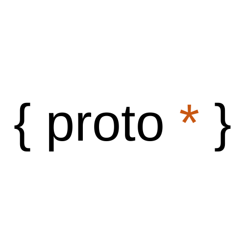

<div align="center">
  </img>
</div>

<h1>Proto Relay</h1>
Proto Relay is a Chrome extension devtool for React Relay based off the official devtool. It is designed to be light-weight, performant, and easy-to-use. 

# Table of Contents
  - insert table of contents later 

## Features
- [x] Preview Relay store content from the Chrome devtools panel
- [x] View store content over time with included snapshots
- [x] View store mutations and network queries

## Installation
1. Fork and clone this repository onto your local computer
2. Install dependencies and run a build using either the 'Yarn' or 'NPM' commands below:
```node
# Yarn
yarn npm install
yarn run build

# NPM
npm run install
npm run build
```
3. Access the Chome extensions within the browser
4. Access [Chrome extensions](chrome://extensions/) within the browser
5. Click on "Load Unpacked"
6. Navigate and select the folder: protostar-relay  > Shells > browser > chrome > build > unpacked
7. Go to a website built with Relay and open the "proto*" panel. Websites that use Relay include:
   - [facebook.com](https://www.facebook.com/)
   - [artsy.com](https://www.artsy.net/)
   - [oculus.com](https://www.oculus.com/)
      

## How to Use
- gif of navigating to a relay page and opening proto*
- gif of typing in the search box, resetting everything
- gif of clicking on artworks below
- gif of interacting with snapshot and store timeline
- gif of navigating between store and network

## Contributing
Protostar-relay is currently in beta release. We encourage you to submit issues for any bugs or ideas for enhancements. Also feel free to fork this repo and submit pull requests to contribute as well. Below are some features we would like to add as we iterate on this project:
- Optimistic updates:
  - Visual representation.
  - List of all optimistic updates with pending/resolved status.
  - Control data flow.
  
## Google Chrome Web Store
Get it on the Chrome Extension Store: [coming soon]().

## Contributors
[Aryeh Kobrinsky](https://github.com/akobrinsky), 
[Liz Lotto](https://github.com/elizlotto), 
[Marc Burnie](https://github.com/marcburnie), 
[Qwen Ballard](https://github.com/qwenballard)


## License
This project is licensed under the MIT License- see the [LICENSE.md](https://github.com/oslabs-beta/protostar-relay/blob/master/LICENSE) for more details.

* Inspired by [Facebook's Relay Devtool](https://github.com/relayjs/relay-devtools)
